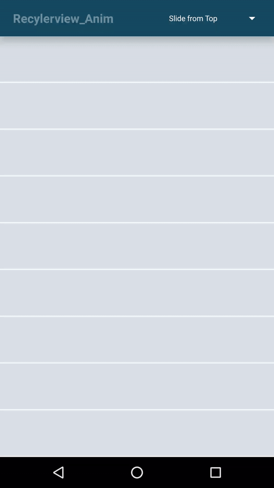

# ItemView-Animation
Several type of Layout Animation using Recylerview,Listview and Gridview.
# Support View
  
  RecyclerView,
  ListView,
  GridView

## Demo

 ## Usage
 ### Step 1 : Add "ItemView-Animation" to your Android project.
 1- Open your project in Android Studio.
   
 2- Download the library
   
 (using Git Link ---> https://github.com/yash786agg/ItemView-Animation.git)
                                        or 
 (Download a zip File archive to unzip)
   
 3- Create a folder "reclv_animation" in your project.
   
 4- Copy and paste the Code to your reclv_animation folder
   
   
 5- On the root of your project directory create/modify the settings.gradle file. It should contain something like the   following:

include ':app',':reclv_animation'
    
   
  6- Go to File > Project Structure > Modules.
   
   7- App > Dependencies.
   
   8- Click on the more on the left green "+" button > Module dependency.
   
   9- Select "reclv_animation Library".
   
   ### Step 2 : Add Code to your Project
   
   For Animation like Slide from Bottom:
   
   LayoutAnimationController animation = AnimationUtils.loadLayoutAnimation(MainActivity.this,getResources().getIdentifier("layout_animation_from_bottom","anim",getPackageName()));
   your_recyclerview.setLayoutAnimation(animation);
   your_adapter.notifyDataSetChanged();
   your_recyclerview.scheduleLayoutAnimation(); 
        
   For Animation like Slide from Top:
   
   LayoutAnimationController animation = AnimationUtils.loadLayoutAnimation(MainActivity.this,getResources().getIdentifier("layout_animation_fall_down","anim",getPackageName()));
   your_recyclerview.setLayoutAnimation(animation);
   your_adapter.notifyDataSetChanged();
   your_recyclerview.scheduleLayoutAnimation(); 
        
   For Animation like Slide from Right:
   
   LayoutAnimationController animation = AnimationUtils.loadLayoutAnimation(MainActivity.this,getResources().getIdentifier("layout_animation_from_right","anim",getPackageName()));
   your_recyclerview.setLayoutAnimation(animation);
   your_adapter.notifyDataSetChanged();
   your_recyclerview.scheduleLayoutAnimation();     
        
   For Animation like Slide from left:
   
   LayoutAnimationController animation = AnimationUtils.loadLayoutAnimation(MainActivity.this,getResources().getIdentifier("layout_animation_from_left","anim",getPackageName()));
   your_recyclerview.setLayoutAnimation(animation);
   your_adapter.notifyDataSetChanged();
   your_recyclerview.scheduleLayoutAnimation();    
   
   
   #Note:

   You can also add this animation after adding all data form server request to arraylist.

    if(notificationAdapter != null)
    {
      LayoutAnimationController animation = AnimationUtils.loadLayoutAnimation(MainActivity.this,getResources().getIdentifier("layout_animation_from_left","anim",getPackageName()));
      your_recyclerview.setLayoutAnimation(animation);
      your_adapter.notifyDataSetChanged();
      your_recyclerview.scheduleLayoutAnimation();    
    }
        
        
